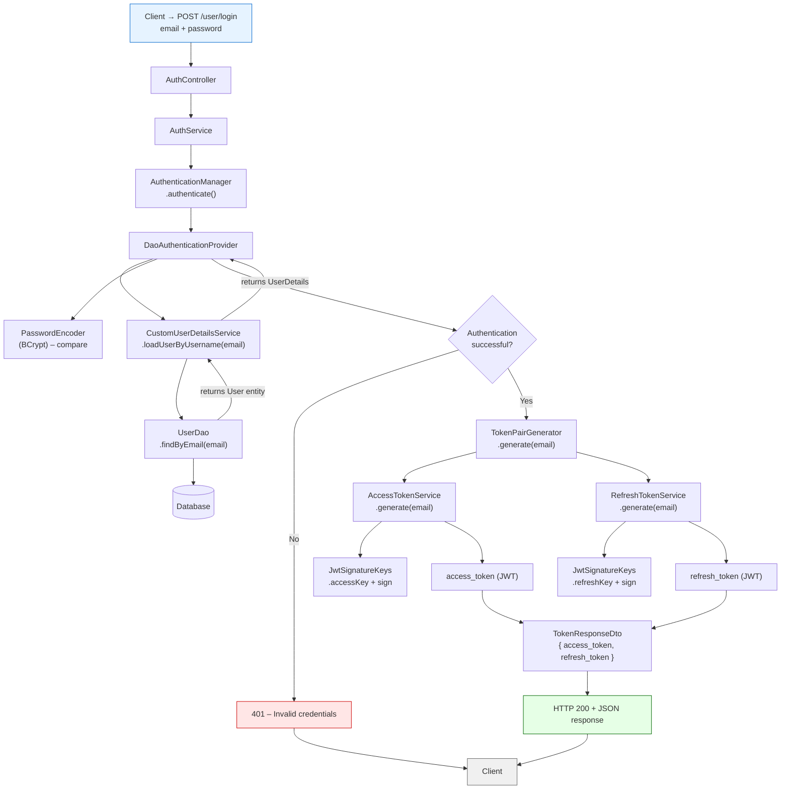

```mermaid
flowchart TD
A["Client → POST /user/login<br>email + password"] --> B["AuthController"]

    B --> C["AuthService"]

    C --> D["AuthenticationManager<br>.authenticate()"]

    D --> E["DaoAuthenticationProvider"]

    E --> F["CustomUserDetailsService<br>.loadUserByUsername(email)"]

    F --> G["UserDao<br>.findByEmail(email)"]

    G --> H[(Database)]

    G -->|returns User entity| F

    F -->|returns UserDetails| E

    E --> I["PasswordEncoder<br>(BCrypt) – compare"]

    E --> J{Authentication<br>successful?}

    J -- No --> K["401 – Invalid credentials"]
    K --> Z[Client]

    J -- Yes --> L["TokenPairGenerator<br>.generate(email)"]

    L --> M["AccessTokenService<br>.generate(email)"]
    L --> N["RefreshTokenService<br>.generate(email)"]

    M --> O["JwtSignatureKeys<br>.accessKey + sign"]
    N --> P["JwtSignatureKeys<br>.refreshKey + sign"]

    M --> Q["access_token (JWT)"]
    N --> R["refresh_token (JWT)"]

    Q --> S["TokenResponseDto<br>{ access_token, refresh_token }"]
    R --> S

    S --> T["HTTP 200 + JSON response"]
    T --> Z[Client]

    style A fill:#e6f3ff,stroke:#0066cc
    style Z fill:#f0f0f0,stroke:#666
    style K fill:#ffe6e6,stroke:#cc0000
    style T fill:#e6ffe6,stroke:#006600
```